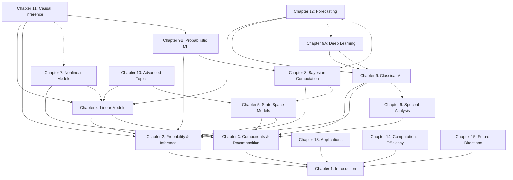

# Chapter Dependencies

## Purpose
This dependency graph helps with selective content loading when working on specific chapters, keeping token usage manageable for LLM context windows.

## Design Principles
- Maximum dependency depth of 3 chapters
- Topic-based grouping rather than sequential
- Core foundations (Ch 1-3) referenced by many chapters
- Target: Keep dependency chains under 40,000 tokens

## Dependency Graph

## Loading Guide

### Chapter Sizes (for token estimation)
- Chapter 1: 3,606 words (~4,800 tokens)
- Chapter 2: 7,155 words (~9,500 tokens)
- Chapter 3: 5,005 words (~6,700 tokens)
- Chapter 4: 5,959 words (~7,900 tokens)
- Chapter 5: 4,339 words (~5,800 tokens)
- Chapter 6: 4,295 words (~5,700 tokens)
- Chapter 7: 5,833 words (~7,800 tokens)
- Chapter 8: 3,797 words (~5,100 tokens)
- Chapter 9: 4,996 words (~6,600 tokens)
- Chapter 9A: 3,298 words (~4,400 tokens)
- Chapter 9B: 2,656 words (~3,500 tokens)
- Chapter 10: 7,641 words (~10,200 tokens)
- Chapter 11: 5,923 words (~7,900 tokens)
- Chapter 12: 7,066 words (~9,400 tokens)
- Chapter 13: 7,815 words (~10,400 tokens)
- Chapter 14: 6,632 words (~8,800 tokens)
- Chapter 15: 7,792 words (~10,400 tokens)

### Example Loading Instructions

**Working on Chapter 12 (Forecasting):**
- Load: Chapters 1, 2, 3, 4, 9, 12
- Tokens: ~39,000
- Optional: Chapter 9A (deep learning), Chapter 8 (Bayesian forecasting)

**Working on Chapter 15 (Future Directions):**
- Load: Chapters 1, 15
- Tokens: ~15,000
- Very efficient for isolated work

**Working on Chapter 11 (Causal Inference):**
- Load: Chapters 1, 2, 3, 4, 11
- Tokens: ~37,000
- Optional: Chapter 7 (for nonlinear causality)

## Notes
- Dotted lines (-.->)indicate optional dependencies
- Load optional chapters only when working on related specific topics
- Applications chapters (13-15) are intentionally independent for flexibility